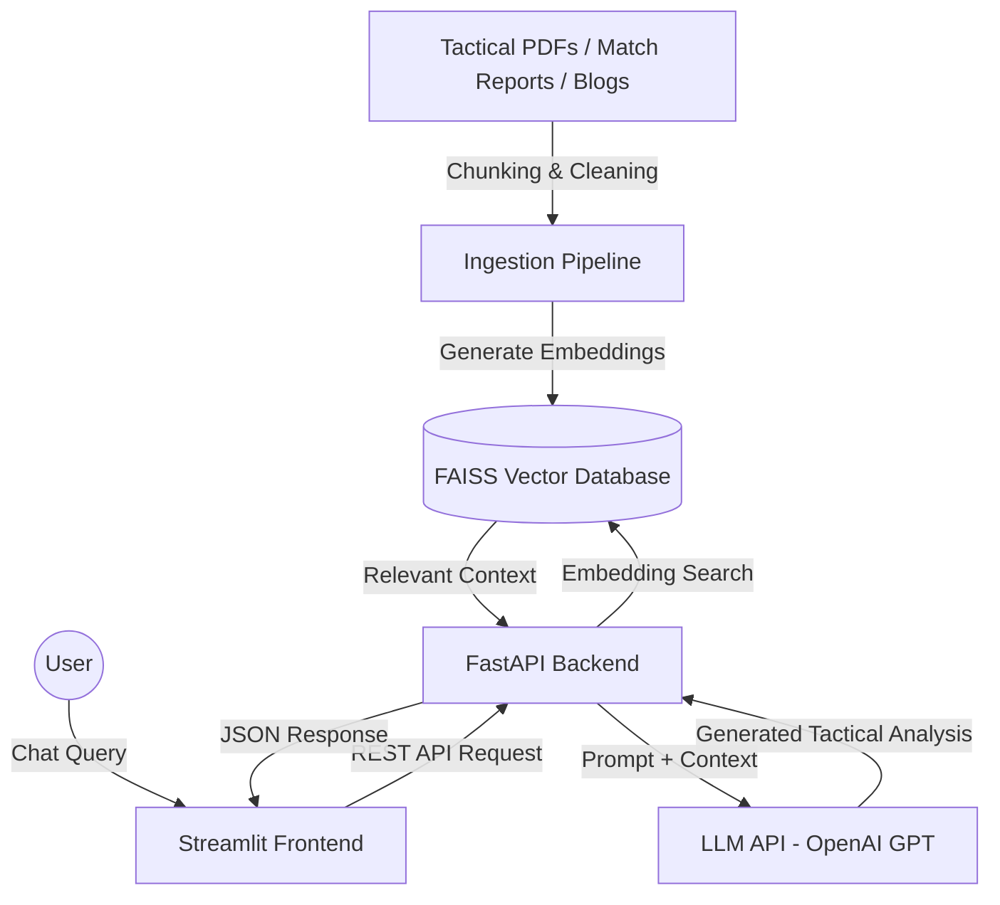

# FootBot
# FootBot ⚽🤖

An intelligent, production-ready Generative AI + RAG (Retrieval-Augmented Generation) application designed for deep football tactics analysis, player comparisons, and match insights.

Unlike generic LLM chatbots, FootBot combines semantic retrieval, domain-specific football knowledge, and LLM reasoning to generate contextual tactical analysis inspired by elite football analysts.

---

# ⚽ Why FootBot?

Modern LLMs struggle with nuanced football analysis because most football content online is:
- shallow
- fragmented
- statistically isolated
- lacking tactical context

FootBot solves this by combining:
- Retrieval-Augmented Generation (RAG)
- Tactical football literature
- Semantic search
- Large Language Models (LLMs)

to create grounded, contextual football intelligence.

---

# 🏗️ System Architecture



---

# 🧠 How It Works

## Step 1 — Data Ingestion
Football tactical PDFs, blogs, and reports are:
- cleaned
- chunked
- embedded into vectors

using embedding models.

---

## Step 2 — Vector Storage
Embeddings are stored inside a FAISS vector database for semantic retrieval.

---

## Step 3 — User Query
The user asks a tactical football question.

Example:

```text
Why did Manchester City dominate the half spaces against Arsenal?
```

---

## Step 4 — Retrieval
FootBot retrieves the most relevant tactical context from the vector database.

---

## Step 5 — LLM Reasoning
The retrieved context is sent to the LLM along with the user query.

The LLM generates:
- grounded tactical reasoning
- player comparisons
- structural football analysis

---

# ✨ Features

## ⚽ Tactical AI Chatbot
Answers advanced football tactical questions using retrieved expert context.

---

## 📊 Player Comparisons
Compares players using:
- positional roles
- tactical responsibilities
- structural impact
- contextual analysis

instead of surface-level statistics.

---

## 🧠 RAG-Based Analysis
Uses retrieval pipelines to reduce hallucinations and improve factual grounding.

---

## ⚡ FastAPI Backend
High-performance backend service handling:
- retrieval
- prompting
- LLM orchestration

---

## 🎨 Streamlit Frontend
Interactive football analysis chat interface.

---

# 🛠️ Tech Stack

| Category | Technology |
|---|---|
| LLM | OpenAI GPT |
| RAG Framework | LangChain |
| Embeddings | SentenceTransformers |
| Vector Database | FAISS |
| Backend | FastAPI |
| Frontend | Streamlit |
| API Server | Uvicorn |
| Language | Python 3.10+ |

---

# 📂 Project Structure

```text
footbot/
│
├── backend/
│   ├── main.py
│   ├── rag_engine.py
│   ├── ingest.py
│   └── utils.py
│
├── frontend/
│   └── app.py
│
├── data/
│   ├── raw/
│   ├── processed/
│   └── embeddings/
│
├── requirements.txt
├── .env.example
└── README.md
```

---

# 🚀 Quick Start

# 1️⃣ Clone Repository

```bash
git clone https://github.com/yourusername/footbot.git

cd footbot
```

---

# 2️⃣ Create Virtual Environment

## Linux / MacOS

```bash
python -m venv venv

source venv/bin/activate
```

## Windows

```bash
python -m venv venv

venv\Scripts\activate
```

---

# 3️⃣ Install Dependencies

```bash
pip install -r requirements.txt
```

---

# 4️⃣ Configure Environment Variables

Create a `.env` file:

```env
OPENAI_API_KEY=your_api_key_here

FAISS_DB_PATH=./data/embeddings
```

---

# 5️⃣ Run Data Ingestion Pipeline

```bash
python backend/ingest.py
```

This:
- processes football documents
- generates embeddings
- builds the FAISS index

---

# 6️⃣ Start FastAPI Backend

```bash
uvicorn backend.main:app --reload --port 8000
```

API Docs:

```text
http://localhost:8000/docs
```

---

# 7️⃣ Start Streamlit Frontend

Open a new terminal:

```bash
streamlit run frontend/app.py
```

---

# 📬 Postman API Integration (Player Headshots)

To test, consume, or retrieve player headshots and position-based avatar silhouettes programmatically:

1. **Import Integration Files**:
   - Open Postman, click **Import**, and select the collection file: [FootBot_Player_Headshots.postman_collection.json](file:///Users/akilan/Documents/FootBot/FootBot/postman/FootBot_Player_Headshots.postman_collection.json)
   - Import the corresponding local environment variables file: [FootBot_Local.postman_environment.json](file:///Users/akilan/Documents/FootBot/FootBot/postman/FootBot_Local.postman_environment.json)
2. **Select Environment**:
   - In the top-right corner of Postman, select the **FootBot Local** environment. This defines the `{{base_url}}` variable as `http://127.0.0.1:8000`.
3. **Run Requests**:
   - **Resolve by Player Name**: `GET {{base_url}}/player/image?name=Lionel Messi` returns Messi's headshot.
   - **Resolve by SofaScore ID**: `GET {{base_url}}/player/image?sofa_id=826725` returns Erling Haaland's photo.
   - **Resolve by Filename directly**: `GET {{base_url}}/player/image?filename=foden.png`
   - **Fallback Silhouette**: `GET {{base_url}}/player/image?name=Nonexistent&pos=GK` (GK silhouette fallback).
   - **Direct Static Assets**: `GET {{base_url}}/assets/lionel_messi.jpg`
   - **Roster Reference Details**: `GET {{base_url}}/roster?team_name=Manchester City` (returns a team's roster with all player details and `sofa_id`).

---

# 🔥 Example Queries

```text
Why did Arsenal dominate central progression against Liverpool?

Compare Rodri and Busquets in positional play.

How does Klopp's gegenpress differ from Arteta's pressing structure?

Why are inverted fullbacks important in modern football?
```

---

# 📊 Future Improvements

- [ ] Hybrid Retrieval (FAISS + BM25)
- [ ] Cross-Encoder Reranking
- [ ] LangSmith Tracing
- [ ] Redis Conversation Memory
- [ ] Docker Containerization
- [ ] Real-Time Football API Integration
- [ ] Streaming LLM Responses
- [ ] React Frontend Migration

---

# 📈 Evaluation Goals

Future evaluation pipeline will measure:
- retrieval relevance
- hallucination reduction
- groundedness
- response quality

using:
- RAGAS
- DeepEval
- LangSmith

---

# ⚠️ Current Limitations

- No real-time football data yet
- Tactical reasoning quality depends on retrieved context quality
- Initial version optimized for English tactical literature

---

# 🤝 Contributing

Contributions, ideas, and tactical football datasets are welcome.

Feel free to fork the project and open pull requests.

---

# 📜 License

MIT License

---

# 👨‍💻 Author

Built by Akilan as a flagship AI engineering project focused on:
- Generative AI
- Retrieval-Augmented Generation
- Applied NLP
- Football Analytics
- AI Systems Engineering