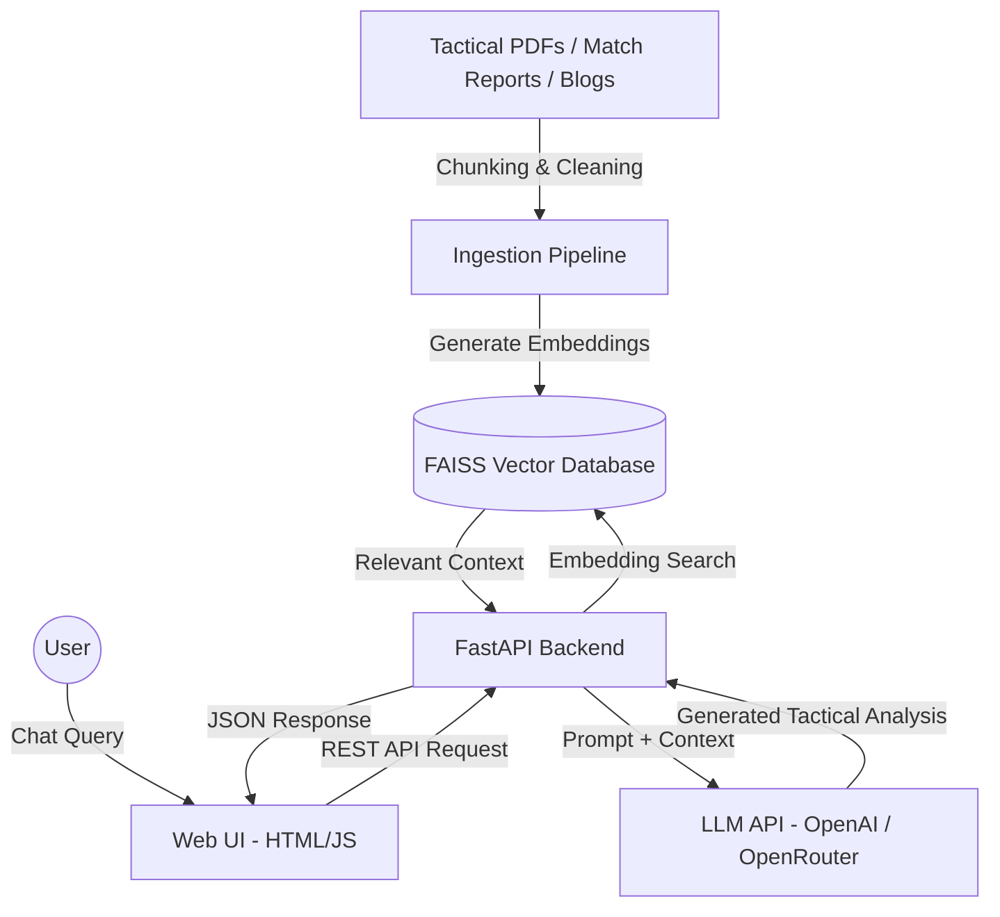

# FootBot ⚽🤖

An intelligent, production-ready Generative AI + RAG (Retrieval-Augmented Generation) application designed for deep football tactics analysis, player comparisons, and match insights.

Unlike generic LLM chatbots, FootBot combines semantic retrieval, domain-specific football knowledge, and LLM reasoning to generate contextual tactical analysis inspired by elite football analysts.

---

# ⚽ Why FootBot?

Modern LLMs struggle with nuanced football analysis because most football content online is:
- shallow
- fragmented
- statistically isolated
- lacking tactical context

FootBot solves this by combining:
- Retrieval-Augmented Generation (RAG)
- Tactical football literature
- Semantic search
- Large Language Models (LLMs)

to create grounded, contextual football intelligence.

---

# 🏗️ System Architecture



---

# 🧠 How It Works

## Step 1 — Data Ingestion
Football tactical PDFs, blogs, and reports are:
- cleaned
- chunked
- embedded into vectors

using embedding models.

---

## Step 2 — Vector Storage
Embeddings are stored inside a FAISS vector database for semantic retrieval.

---

## Step 3 — User Query
The user asks a tactical football question.

Example:

```text
Why did Manchester City dominate the half spaces against Arsenal?
```

---

## Step 4 — Retrieval
FootBot retrieves the most relevant tactical context from the vector database.

---

## Step 5 — LLM Reasoning
The retrieved context is sent to the LLM along with the user query.

The LLM generates:
- grounded tactical reasoning
- player comparisons
- structural football analysis

---

# ✨ Features

## ⚽ Tactical AI Chatbot
Answers advanced football tactical questions using retrieved expert context.

---

## 📊 Player Comparisons
Compares players using:
- positional roles
- tactical responsibilities
- structural impact
- contextual analysis

instead of surface-level statistics.

---

## 🧠 RAG-Based Analysis
Uses retrieval pipelines to reduce hallucinations and improve factual grounding.

---

## ⚡ FastAPI Backend
High-performance backend service handling:
- retrieval
- prompting
- LLM orchestration

---

## 🎨 Web Interface
Interactive football analysis UI - tactical chat, 2D formation board, live
scorelines and match centre - served directly by the backend at `/`.

---

# 🛠️ Tech Stack

| Category | Technology |
|---|---|
| LLM | OpenAI-compatible (OpenAI or OpenRouter) |
| RAG Framework | LangChain |
| Embeddings | SentenceTransformers |
| Vector Database | FAISS |
| Backend | FastAPI |
| Frontend | HTML/CSS/JS (served by FastAPI) |
| API Server | Uvicorn |
| Language | Python 3.10+ |

---

# 📂 Project Structure

```text
footbot/
│
├── backend/
│   ├── main.py            # FastAPI app: API + serves the web UI
│   ├── rag_engine.py      # hybrid retrieval, query expansion, re-ranking
│   ├── database.py        # SQLite: users, sessions, matches, API caches
│   ├── roster_store.py    # squad/lineup resolution and player photos
│   ├── loaders/           # API-Football client, BBC scrapers, PDF/blog loaders
│   ├── ingest.py
│   └── utils.py
│
├── frontend/
│   ├── index.html         # the web UI, served by the backend at /
│   └── assets/            # player photos, silhouettes, icons
│
├── data/
│   ├── raw/
│   ├── processed/
│   └── embeddings/
│
├── tests/                 # pytest suite
├── postman/               # Postman collection + local environment
├── Dockerfile.backend
├── docker-compose.yml
├── requirements.txt
├── .env.example
└── README.md
```

---

# 🚀 Quick Start

# 1️⃣ Clone Repository

```bash
git clone https://github.com/Akilan-J/FootBot.git

cd FootBot
```

---

# 2️⃣ Create Virtual Environment

## Linux / MacOS

```bash
python -m venv venv

source venv/bin/activate
```

## Windows

```bash
python -m venv venv

venv\Scripts\activate
```

---

# 3️⃣ Install Dependencies

```bash
pip install -r requirements.txt
```

---

# 4️⃣ Configure Environment Variables

Copy the template and fill it in — it documents every supported setting:

```bash
cp .env.example .env
```

At minimum you need an LLM key; `API_FOOTBALL_KEY` is optional but needed for
real fixtures, lineups and team crests:

```env
OPENAI_API_KEY=your_api_key_here
API_FOOTBALL_KEY=your_api_football_key_here
```

---

# 5️⃣ Run Data Ingestion Pipeline

```bash
python backend/ingest.py
```

This:
- processes football documents
- generates embeddings
- builds the FAISS index

---

# 6️⃣ Start FastAPI Backend

```bash
uvicorn backend.main:app --reload --port 8000
```

API Docs:

```text
http://localhost:8000/docs
```

---

# 7️⃣ Open the Web UI

The backend serves the web interface itself — no separate frontend process needed:

```text
http://localhost:8000
```

---

# 🐳 Run with Docker

The backend image serves both the API and the web UI on port 8000:

```bash
docker compose up --build
```

---

# 🧪 Running Tests

```bash
pytest
```

That runs the fast suite (database, auth/session tokens, API-Football client) in
under a second. Endpoint tests are marked `slow` because they import the full app
and load the embedding model:

```bash
pytest -m ""        # everything, including the endpoint tests
pytest -m slow      # only the endpoint tests
```

---

# 📬 Postman API Integration (Player Headshots)

To test, consume, or retrieve player headshots and position-based avatar silhouettes programmatically:

1. **Import Integration Files**:
   - Open Postman, click **Import**, and select the collection file: [postman/FootBot_Player_Headshots.postman_collection.json](postman/FootBot_Player_Headshots.postman_collection.json)
   - Import the corresponding local environment variables file: [postman/FootBot_Local.postman_environment.json](postman/FootBot_Local.postman_environment.json)
2. **Select Environment**:
   - In the top-right corner of Postman, select the **FootBot Local** environment. This defines the `{{base_url}}` variable as `http://127.0.0.1:8000`.
3. **Run Requests**:
   - **Resolve by Player Name**: `GET {{base_url}}/player/image?name=Lionel Messi` returns Messi's headshot.
   - **Resolve by SofaScore ID**: `GET {{base_url}}/player/image?sofa_id=826725` returns Erling Haaland's photo.
   - **Resolve by Filename directly**: `GET {{base_url}}/player/image?filename=foden.png`
   - **Fallback Silhouette**: `GET {{base_url}}/player/image?name=Nonexistent&pos=GK` (GK silhouette fallback).
   - **Direct Static Assets**: `GET {{base_url}}/assets/lionel_messi.jpg`
   - **Roster Reference Details**: `GET {{base_url}}/roster?team_name=Manchester City` (returns a team's roster with all player details and `sofa_id`).

---

# 🔥 Example Queries

```text
Why did Arsenal dominate central progression against Liverpool?

Compare Rodri and Busquets in positional play.

How does Klopp's gegenpress differ from Arteta's pressing structure?

Why are inverted fullbacks important in modern football?
```

---

# 📊 Future Improvements

Delivered:

- [x] Hybrid Retrieval (FAISS dense + BM25 lexical, fused per query)
- [x] LLM-based query expansion and re-ranking
- [x] Real-Time Football API Integration (API-Football + BBC Sport)
- [x] Docker Containerization
- [x] Dedicated web UI (replaced the original Streamlit prototype)
- [x] Automated test suite (`pytest`)

Still open:

- [ ] Cross-Encoder Reranking (re-ranking is currently LLM-based)
- [ ] LangSmith Tracing
- [ ] Redis Conversation Memory (conversations live in SQLite today)
- [ ] Streaming LLM Responses

---

# 📈 Evaluation Goals

Future evaluation pipeline will measure:
- retrieval relevance
- hallucination reduction
- groundedness
- response quality

using:
- RAGAS
- DeepEval
- LangSmith

---

# ⚠️ Current Limitations

- Tactical reasoning quality depends on retrieved context quality
- Optimized for English tactical literature
- Live data depends on third-party sources: API-Football's free tier allows only
  10 requests/minute (requests are throttled to stay under it), and the BBC Sport
  scrapers are tied to that site's current page structure
- Squad/lineup data falls back to LLM-generated rosters when API-Football has no
  fixture, so those values are approximate rather than authoritative

---

# 🤝 Contributing

Contributions, ideas, and tactical football datasets are welcome.

Feel free to fork the project and open pull requests.

---

# 📜 License

MIT License

---

# 👨‍💻 Author

Built by Akilan as a flagship AI engineering project focused on:
- Generative AI
- Retrieval-Augmented Generation
- Applied NLP
- Football Analytics
- AI Systems Engineering